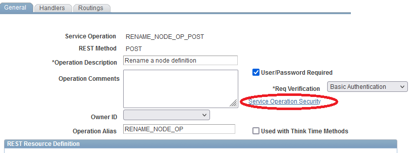

# About

I needed to be able to fully automate a deploy and refresh of a development
server. One aspect of this is the need to rename the default local node and set
the node password and modify the portal/content URLs to match the development
environment instead of reflecting the production data.

This is a PeopleSoft REST service that allows renaming nodes and setting the
node data.

# Deploying to a PeopleSoft instance

Simply copy the included project to the production instance before a refresh.
You should probably open the service operation RENAME_NODE_OP_POST and add the
permission lists for your environment that you want to allow to rename the
local nodes.



Then do your usual refresh procedure. Instead of manually having to rename the
node by clicking the button in PIA, just run a POST to a service operation.

# How to use

Send this JSON
```json
{
    "RENAME_NODE_REQ": {
        "old_node_name": "PSFT_PROD",
        "new_node_name": "PSFT_DEV",
        "node_password": "this is a new password",
        "portal_uri": "https://dev-domain.tld/psp/ps/",
        "content_uri": "https://dev-domain.tld/psc/ps/",
        "purge_messages": true
    }
}
```

with basic HTTP authentication credentials to

```
https://dev-domain.tld/PSIGW/RESTListeningConnector/PSFT_HR_PROD/RENAME_NODE_OP.v1/RenameNode/
```

The `node_password`, `portal_uri`, and `content_uri` parameters are optional.
You can leave them blank or omit them if you do not wish to set those
properties.

If the `purge_messages` field is `true`, the service operation will run the
`appmsgpurgeall.dms` script before renaming to eliminate errors that there
are messages in the run time tables.

If the node is the local default node, make sure the bounce PIA.

## Powershell example

[Powershell Code](rename_node.ps1)


